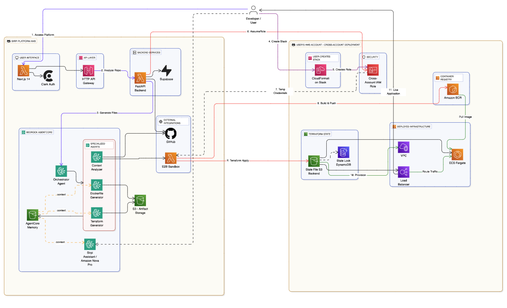

# Sirpi - AI-Native DevOps Automation Platform

<div align="center">


**Transform GitHub repositories into production-ready AWS infrastructure**

[](https://aws.amazon.com/bedrock/)
[](https://aws.amazon.com/bedrock/agentcore/)

</div>

---

## What is Sirpi?

Sirpi (*Tamil: sculptor*) is an AI-native DevOps automation platform that transforms GitHub repositories into production-ready AWS infrastructure. Using Amazon Bedrock AgentCore's multi-agent orchestration, Sirpi analyzes codebases, generates optimized Dockerfiles and Terraform configurations, and deploys complete cloud infrastructure—no DevOps expertise required.

---

## Key Features

**Multi-Agent AI System**  
Specialized agents collaborate via Amazon Bedrock AgentCore Memory for stateful context sharing across the workflow.

**Smart Containerization**  
Automatic Dockerfile generation optimized for your specific tech stack and dependencies.

**Infrastructure as Code**  
Production-ready Terraform configurations for complete AWS infrastructure provisioning.

**Secure Cross-Account Deployment**  
Deploy into your own AWS account using IAM role assumption—no access keys or credentials shared.

**Sandboxed Execution**  
All Docker builds and Terraform operations execute in isolated E2B sandboxes with real-time log streaming to the frontend.

**Complete CI/CD Pipeline**  
From GitHub URL to live application in minutes with real-time deployment tracking.

**AI Assistant**  
Context-aware support powered by Amazon Nova Pro with full deployment history access via AgentCore Memory.

**No Vendor Lock-in**  
Download all generated Terraform files and state files. Manage or delete your infrastructure anytime. Migrate to other platforms if needed—you own all the code.

---

## Architecture



### System Components

**Sirpi Platform**
- Frontend: Next.js 14 with Clerk authentication
- Backend: FastAPI on AWS Lambda
- Multi-Agent System: Amazon Bedrock AgentCore
  - Orchestrator Agent
  - Context Analyzer Agent
  - Dockerfile Generator Agent
  - Terraform Generator Agent
- AI Assistant: Amazon Nova Pro
- External Tools: E2B Sandboxes for secure code execution
- Storage: S3 for artifacts, Supabase for metadata

**User's AWS Account**
- Security: Cross-account IAM role with least-privilege access
- Container Registry: Amazon ECR
- Infrastructure: Provisioned via Terraform (VPC, Load Balancer, compute resources)
- State Management: S3 backend with DynamoDB locking

### How It Works

1. **Connect** - Link your GitHub repository through OAuth
2. **Analyze** - AI agents examine your codebase, detect tech stack, and analyze dependencies using GitHub API
3. **Generate** - Create optimized Dockerfile and Terraform configurations via LLM reasoning
4. **Review** - Generated files submitted as Pull Request to your repository
5. **Setup** - Create CloudFormation stack in your AWS account using provided template, obtain IAM role ARN
6. **Verify** - Backend assumes IAM role to verify cross-account access
7. **Build & Push** - Docker image built in E2B sandbox and pushed to your ECR with real-time log polling
8. **Deploy** - Terraform plan and apply executed in E2B sandbox, provisions infrastructure in your AWS account with live progress updates
9. **Manage** - Monitor your infrastructure or destroy everything with one click (automatic state cleanup)

### E2B Sandbox Integration

All code execution happens in isolated E2B sandboxes for security:

- **Repository Analysis** - Clone and analyze dependencies in sandbox environment
- **Docker Builds** - Build container images safely without exposing Sirpi infrastructure
- **Terraform Execution** - Run infrastructure provisioning commands in isolated environment
- **Real-time Streaming** - All sandbox logs streamed live to frontend via Server-Sent Events

This ensures malicious code in user repositories cannot compromise the Sirpi platform while providing full visibility into execution.

---

## Quick Start

### Prerequisites

- AWS Account
- GitHub Account
- Node.js 20+ and Python 3.11+
- UV package manager

### Installation

```bash
git clone https://github.com/yourusername/sirpi.git
cd sirpi

# Backend setup
cd backend
python -m venv .venv
source .venv/bin/activate
uv pip install -r requirements.txt
cp .env.example .env  # Configure your environment

# Frontend setup
cd ../frontend
npm install
cp .env.local.example .env.local  # Configure your environment

# Start development servers
cd backend && uvicorn src.main:app --reload
cd frontend && npm run dev
```

### Configuration

See individual documentation:
- [Backend Setup](./backend/README.md)
- [Frontend Setup](./frontend/README.md)

---

## Repository Structure

```
sirpi/
├── backend/              FastAPI backend with AgentCore agents
├── frontend/             Next.js frontend application
├── infrastructure/       AWS CDK infrastructure for Sirpi platform
└── README.md
```

---

## Agent System

Sirpi uses Amazon Bedrock AgentCore for multi-agent collaboration. Agents communicate through AgentCore Memory primitives to share context and build on each other's analysis.

**Orchestrator Agent** - Coordinates workflow and delegates to specialized agents

**Context Analyzer** - Examines repository structure, detects tech stack, analyzes dependencies. Integrates with GitHub API and E2B sandboxes for safe code execution.

**Dockerfile Generator** - Creates optimized, production-ready container configurations using LLM reasoning based on detected tech stack

**Terraform Generator** - Generates complete infrastructure-as-code using LLM with context from previous agents

**AgentCore Memory** - Enables stateful collaboration between agents without hardcoded workflows. Each agent reads context from memory and writes its results for subsequent agents.

### AI Agent Qualifications

Sirpi meets AWS AI agent requirements:

**Reasoning LLMs** - Amazon Bedrock models power all agent decision-making for analysis, generation, and optimization

**Autonomous Capabilities** - Multi-agent workflow executes end-to-end with minimal human input (only repository selection and approval gates)

**External Tool Integration** - GitHub API for repository access, E2B sandboxes for secure code execution, Terraform for infrastructure provisioning

**Agent Collaboration** - Agents communicate via AgentCore Memory primitives for stateful, context-aware operations

---

## Technology Stack

**Frontend**
- Next.js 14, TypeScript, Tailwind CSS
- Clerk Authentication
- Real-time log polling (2-second intervals via API Gateway)

**Backend**
- FastAPI (Python 3.11) on AWS Lambda
- API Gateway HTTP API for REST endpoints
- Long-running operations (15-minute Lambda timeout)
- In-memory session storage for active deployments
- Amazon Bedrock AgentCore
- Amazon Nova Pro
- E2B Sandboxes
- Supabase PostgreSQL
- UV package manager

**Infrastructure**
- AWS Lambda, Amazon ECS, Amazon ECR
- Terraform, AWS CDK
- Cross-account IAM roles

---

## Security

**Cross-Account Deployment**  
Infrastructure deploys into the user's AWS account. No credentials are stored or shared—only IAM role assumption for secure, temporary access.

**Sandboxed Execution**  
All code analysis, Docker builds, and Terraform operations execute in isolated E2B sandboxes, preventing malicious code from compromising the platform.

**Least-Privilege Access**  
IAM roles are scoped to minimum required permissions for deployment operations.

**Complete Audit Trail**  
All infrastructure provisioned via CloudFormation with full tracking and versioning.

**Clean Deletion**  
One-click teardown removes all resources and automatically cleans up Terraform state files.

---

## Contact

**Developer**: Raj Sudharshan  
**Website**: [rajs.dev](https://rajs.dev)  
**LinkedIn**: [linkedin.com/in/sudharshann05](https://www.linkedin.com/in/sudharshann05/)

---
</div>
